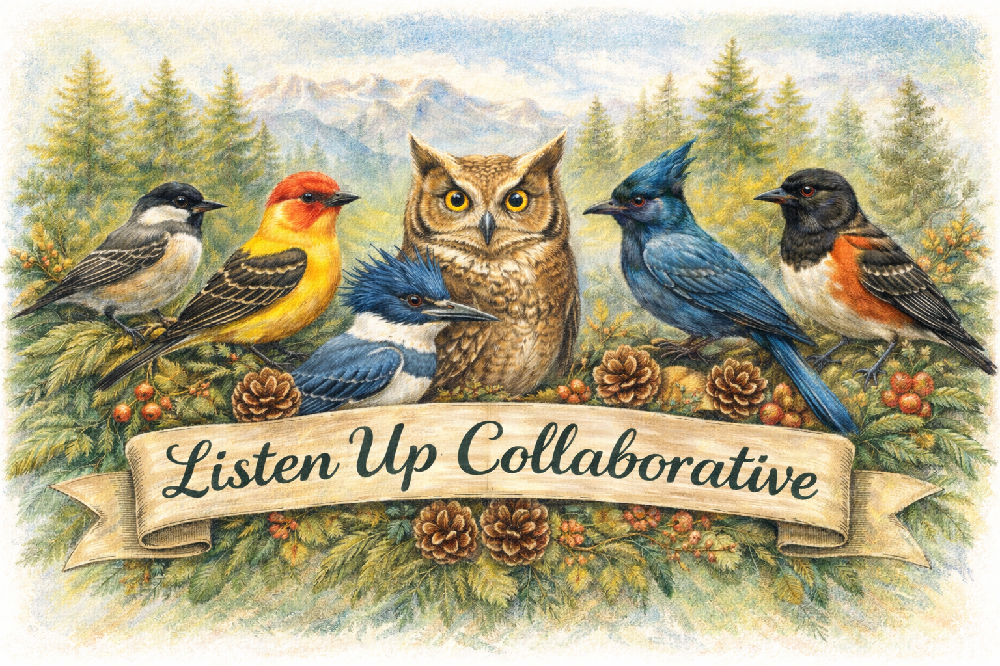

# Listen Up Collaborative

## About
The Listen Up Collaborative uses acoustic bird monitoring to assess the effectiveness of forest restoration and habitat management across the Olympic Peninsula and Kitsap County in Washington State.

Started in 2022, our collaborative brings together seven partner organizations to monitor bird presence and vocalizations as indicators of habitat quality.

## Partners
- Great Peninsula Conservancy
- Jefferson Land Trust
- Bainbridge Island Land Trust
- Northwest Natural Resource Group
- Point No Point Treaty Council
- Jamestown S'Klallam Tribe
- Kitsap County Parks

## Our Work
We deploy AudioMoth acoustic recording devices at 100+ sites to monitor 58 bird species, including 7 Species of Greatest Conservation Need and 13 Species of Continental Concern. We've collected over 400,000 recordings to track how birds respond to habitat improvements like selective thinning, snag creation, brush piles, and native plantings.

## Repository Structure

**Code/**
- Jupyter_Notebooks/ - Interactive analysis notebooks (see doc for conventions)
- Python/ - Python scripts for data processing (see doc for conventions)
- R/ - R scripts for statistical analysis (see doc for conventions)

**Data/**
- Pattern_Matching_Templates/ - Shared Arbimon PM templates (see README for naming conventions and usage instructions)

**Resources/**
- Project documentation, protocols, and reference materials

**Team_Folders/**
- Individual folders for each partner organization's work

## Getting Started
1. Review the documentation files in each Code subfolder for coding conventions
2. Check Data/Pattern_Matching_Templates for shared Arbimon templates and usage instructions
3. Explore Resources for project protocols and documentation
4. Use your organization's Team_Folders directory for team-specific work

## Data Analysis
We use Arbimon for species detection and analysis. All acoustic data follows standardized protocols for collection, processing, and quality control across partner sites.

## Contact
For questions about this repository or the Listen Up Collaborative, contact [insert contact info or link].

## Acknowledgments
Initial funding provided by Cornell Lab of Ornithology's Land Trust Bird Conservation Initiative. Thank you to all partner organizations and field technicians who make this work possible.
